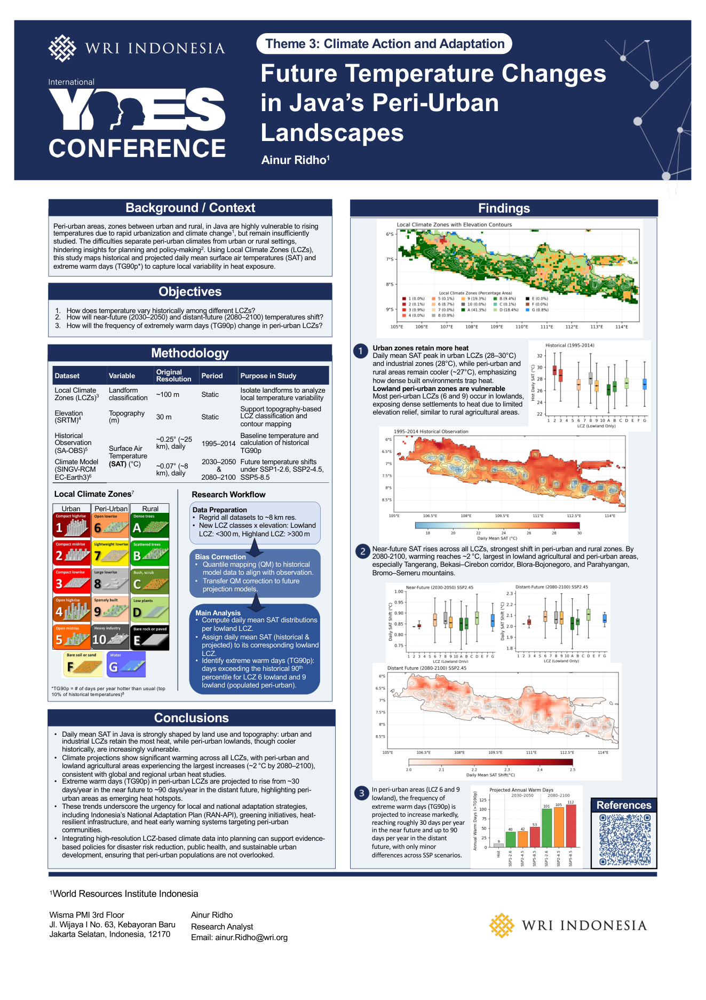
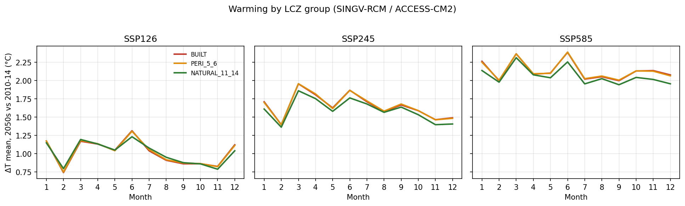
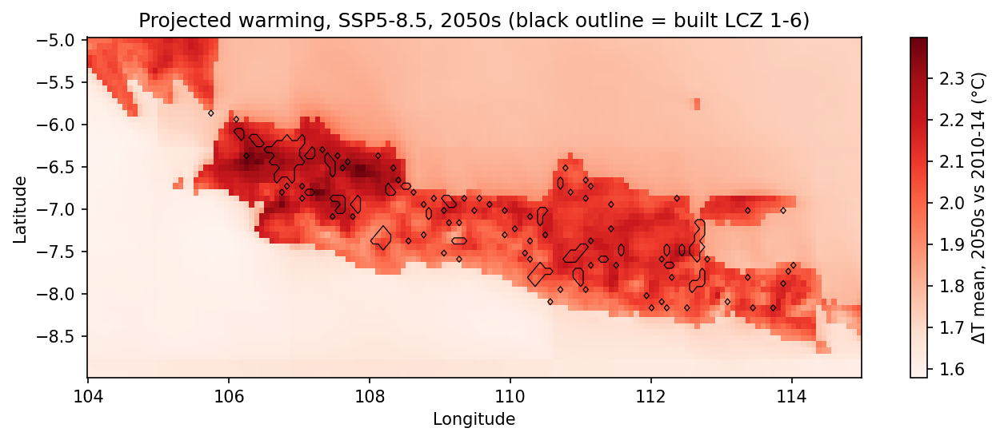

# Future Temperature Changes in Java's Peri-Urban Landscapes

Code behind the research poster *Future Temperature Changes in Java's Peri-Urban Landscapes* (International YES Conference, Theme 3: Climate Action and Adaptation), Ainur Ridho, World Resources Institute Indonesia.

[](figures/poster_yes_conference.pdf)

*Poster results use SA-OBS and EC-Earth3; the notebooks here are a follow-up that explores ERA5-Land, ACCESS-CM2 and canopy effects.*

## Poster summary
Peri-urban areas in Java are highly vulnerable to rising temperatures but remain understudied. Using Local Climate Zones (LCZs), the study maps historical and projected daily mean surface air temperature (SAT) and extreme warm days (TG90p: days per year above the historical 90th percentile).

**Research questions**
1. How does temperature vary historically among LCZs?
2. How will near-future (2030–2050) and distant-future (2080–2100) temperatures shift?
3. How will the frequency of extremely warm days (TG90p) change in peri-urban LCZs?

**Data and method:** LCZ map (~100 m), SRTM elevation (30 m), SA-OBS observations (~25 km, 1995–2014), SINGV-RCM driven by EC-Earth3 (~8 km; SSP1-2.6, SSP2-4.5, SSP5-8.5). All data regridded to ~8 km, LCZs split into lowland (<300 m) and highland (>300 m), quantile-mapping bias correction against observations, then daily mean SAT and TG90p per lowland LCZ (LCZ 6 and 9 as the populated peri-urban classes).

**Key findings**
- Urban LCZs (28–30 °C) and industrial zones (28 °C) have the highest daily mean SAT; peri-urban and rural areas are ~27 °C.
- Warming reaches ~2 °C by 2080–2100, largest in lowland agricultural and peri-urban areas (Tangerang, Bekasi–Cirebon corridor, Blora–Bojonegoro, Parahyangan, Bromo–Semeru).
- TG90p in peri-urban lowland LCZs rises from ~30 days/year (near future) to ~90 days/year (distant future), with minor differences across SSPs.

## Follow-up analysis in this repo
Notebook 02 uses the SINGV-RCM / ACCESS-CM2 monthly data (2010–14 baseline, 2050s projections; raw model output, no bias correction) grouped by LCZ.





- Baseline (2010–14) mean temperature is highest in built LCZs 1–6 (26.9 °C) vs natural LCZ 11–14 (25.6 °C).
- 2050s warming over the baseline, annual mean, is about +1.0 °C (SSP1-2.6), +1.6 °C (SSP2-4.5) and +2.1 °C (SSP5-8.5), and is almost identical across LCZ groups (built vs natural differ by ≤0.1 °C). The spatial pattern is driven more by geography (West Java warms most) than by land cover at this ~8 km resolution.
- Notebooks 03 and 04 (Tmax95 × LCZ × canopy at 100 m) are templates: they need inputs not included here (land surface temperature, Tmax95 rasters, aggregated canopy height), so they ship without saved outputs.

## Repository contents
| # | Notebook | Purpose |
|---|---|---|
| 01 | `notebooks/01_download_era5land_inspect_cordex.ipynb` | Download ERA5-Land via CDS API; inspect CORDEX files |
| 02 | `notebooks/02_cordex_lcz_urban_natural_contrast.ipynb` | Baseline and SSP projections by LCZ group, urban–natural contrast, figures (**outputs saved**) |
| 03 | `notebooks/03_tmax95_lcz_canopy.ipynb` | Tmax95 × LCZ × canopy at 100 m (template) |
| 04 | `notebooks/04_tmax95_lcz_canopy_era5_cordex.ipynb` | Same with ERA5-Land baseline and CORDEX Tmax95 (template) |

`extras/bali_nbs_minimal.ipynb`: side workflow (Nature-based Solutions score for Bali). `scripts/convert_tiff_to_nc.py`: GeoTIFF → NetCDF (needs GDAL). `Java_Coastline/`: Java boundary shapefile. `figures/`: poster and result figures.

## Data
Raw data is **not** in this repo (too large). Place it in `data/`:

| Dataset | Source |
|---|---|
| LCZ map, 100 m (`data/LCZ_Subset_Java.tif`) | WUDAPT / LCZ-Global |
| SINGV-RCM monthly tas, tasmin, tasmax (`data/t2m_java_hist_proj/`) | CORDEX-SEA, driven by ACCESS-CM2 (historical, SSP1-2.6, SSP2-4.5, SSP5-8.5) |
| ERA5-Land (`data/era5land.nc`) | Copernicus Climate Data Store (needs a CDS account) |
| Canopy height, ~1 m | Meta / WRI global canopy height map |

## How to run
```bash
pip install -r requirements.txt
jupyter lab        # start from the repo root; notebooks use paths relative to it
```

## Reference
Hendrawan et al. (2024), *Future exposure of rainfall and temperature extremes to the most populous cities in Indonesia*, Int. J. Climatol.
